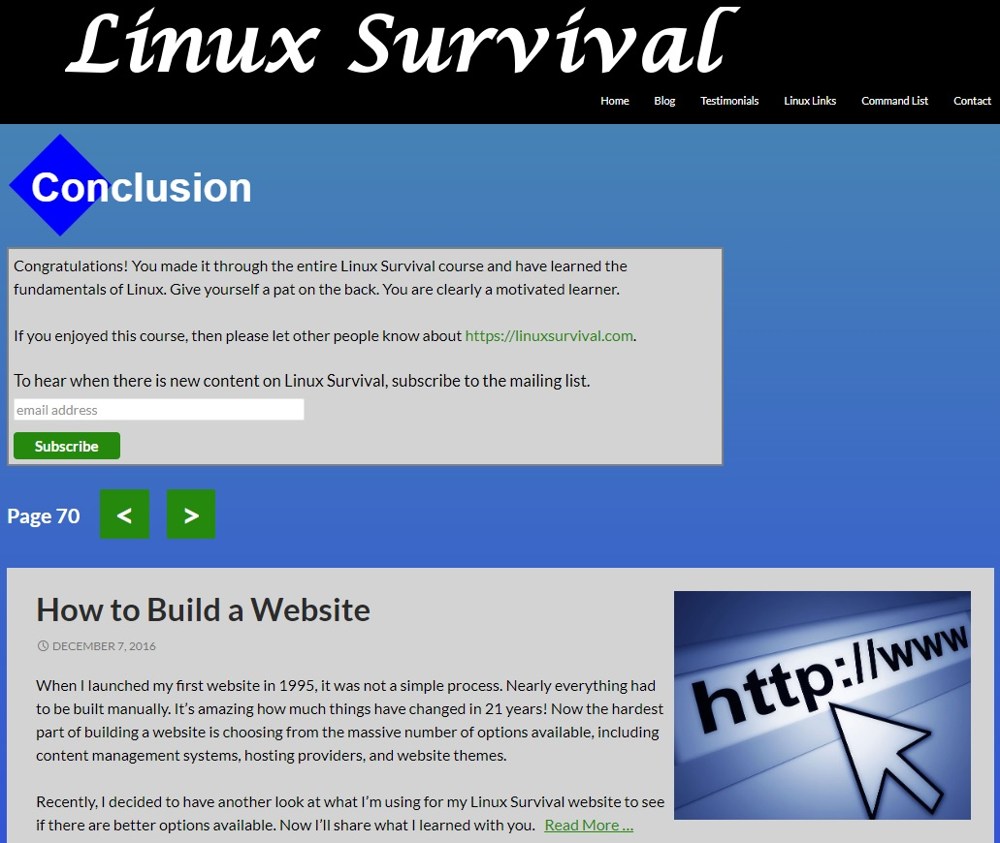
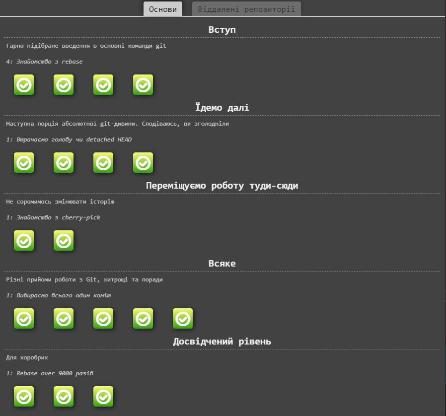

# [Kottans](https://kottans.org/)
## [Kottans frontend course](https://github.com/kottans/frontend)
## General
- [x] **Git Basics**

[Introduction to Git and GitHub](https://www.coursera.org/learn/introduction-git-github)
- [x] **Linux CLI and Networking**

[Linux, Command Line, HTTP Tools](https://linuxsurvival.com/linux-tutorial-end-of-module-4/)  

Screenshot

  

  

  

- [x] **VCS (hello gitty), GitHub and Collaboration**

[learngitbranching.js.org](https://learngitbranching.js.org/?locale=uk)  

Screenshot

  

  

  

